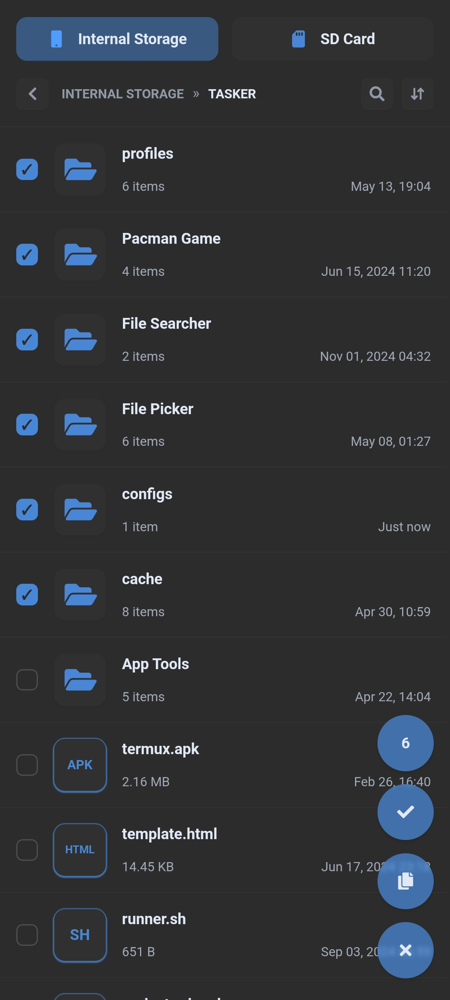

# FILE PICKER

Um seletor de arquivos e pastas leve, sem dependências, feito com HTML5, CSS3 e JavaScript puro. Projetado para uso independente ou integrado com ambientes como o Tasker no Android, ele permite navegação hierárquica, seleção múltipla, busca e cache de diretórios via localStorage.

---

## Tabela de Conteúdos

- [Demonstração](#demonstração)
- [Funcionalidades](#funcionalidades)
- [Tecnologias](#tecnologias)
- [Como Utilizar](#como-utilizar)
- [Estrutura do Projeto](#estrutura-do-projeto)
- [Contribuição](#contribuição)
- [Licença](#licença)

---

## Demonstração

<p align="center">
  
</p>

---

## Funcionalidades

- **Navegação hierárquica** com trilhas e botão de voltar
- **Listagem com Metadados**: tamanho e contagem de itens por pasta
- **Seleção múltipla** de arquivos e pastas e cópia dos caminhos
- **Busca local** por arquivos e pastas no diretório atual
- **Renderização otimizada** com scroll infinito
- **Internacionalização (i18n)** baseada no ambiente (pt-BR, en-US, es-ES)
- **Modo claro/escuro** baseado no ambiente
- **Cache de diretórios** para carregamento rápido
- **Compatível com Tasker (Android)** via script shell `file-picker.sh`

---

## Tecnologias

- **Frontend**: HTML5 + CSS3 + JavaScript
- **Backend (opcional)**: Script shell SH `file-picker.sh` para integração com Tasker ou outro ambiente hospedeiro.

---

## Como Utilizar

### Uso Isolado (modo demonstração)

1. Clone o repositório:

   ```
   git clone https://github.com/x-mrrobot/file-picker.git
   ```

2. Navegue para a pasta do projeto:

   ```
   cd file-picker
   ```

3. Acesse `index.html` no navegador (clique no arquivo ou abra com um servidor local).

A navegação usará dados mockados via `data.js`.

### Uso com Tasker (Android)

Para usar o seletor de arquivos diretamente no Tasker:

1. Instale o Tasker na [Play Store](https://play.google.com/store/apps/details?id=net.dinglisch.android.taskerm)
2. **Importe o projeto** na [TaskerNet](https://taskernet.com/shares/?user=AS35m8k%2FEQCE%2BJiPvkN1cJcjBE7Yh%2B%2Fa8zZeifxINYS7E94XnS26HrYYgsweBVnbf2VB9WJdrS5k&id=Project%3AFILE+PICKER)
3. **Mostre a cena** executando a tarefa **FP - FILE PICKER**
4. **Receba o resultado da seleção** na aba toque no link do webview

### Uso Integrado em outros ambientes

1. O ambiente hospedeiro deve:
   - Executar comandos via `file-picker.sh`
   - Expor propriedades:
     - `languageCode: "en-US"`
     - `darkThemeEnabled: true`
   - Expor métodos:
     - `execute(command, ...args)`
     - `notify(message)`
     - `terminate()`
     - `submitSelection(items)`
2. Comandos esperados no script:
   - `list_directory "caminho"`
   - `get_sd_card`
   - `get_subfolder_item_count "caminho"`

---

## Estrutura do Projeto

```
.
├── index.html
├── css/
│   ├── variables.css
│   ├── reset.css
│   ├── loading.css
│   ├── header.css
│   ├── navigation.css
│   ├── search.css
│   ├── file-list.css
│   ├── checkbox.css
│   └── footer.css
├── js/
│   ├── fileSystemData.js
│   ├── webEnvironment.js
│   ├── Utils.js
│   ├── EnvironmentManager.js
│   ├── I18nManager.js
│   ├── AppState.js
│   ├── CacheManager.js
│   ├── DOMElements.js
│   ├── FileManager.js
│   ├── NavigationManager.js
│   ├── SearchManager.js
│   ├── SelectionManager.js
│   ├── PaginationManager.js
│   ├── FileListRenderer.js
│   ├── PullToRefreshManager.js
│   ├── UIRenderer.js
│   ├── EventManager.js
│   └── App.js
└── file-picker.sh
```

---

## Contribuição

Contribuições são bem-vindas! Sinta-se à vontade para:

- Abrir _issues_ com sugestões ou problemas.
- Enviar _pull requests_ com melhorias, correções ou novas funcionalidades.

---

## Licença

Este projeto está licenciado sob a [MIT License](https://opensource.org/licenses/MIT).
